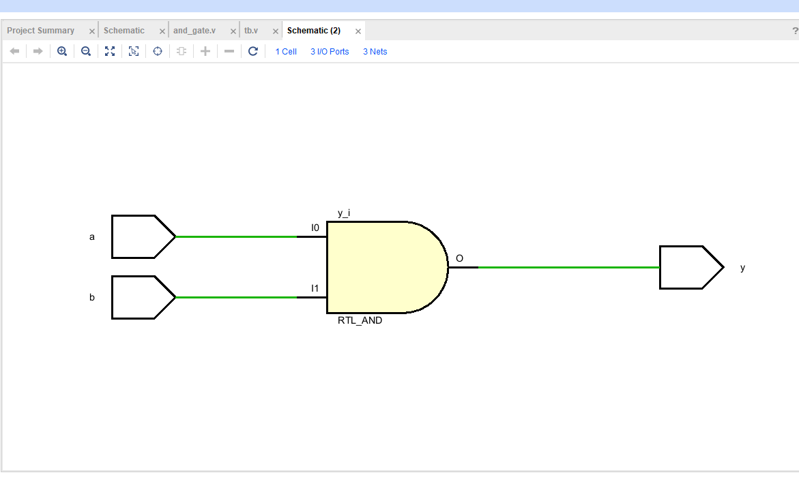
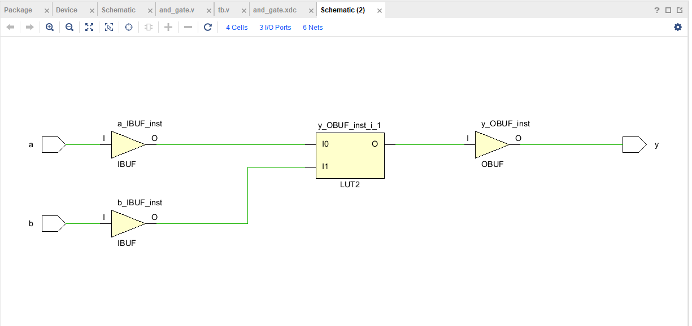
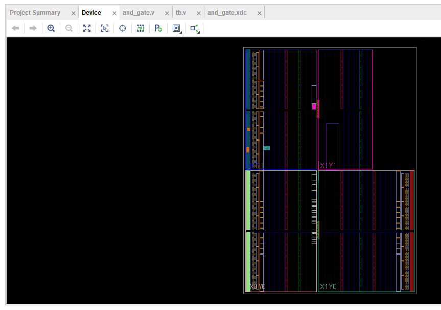
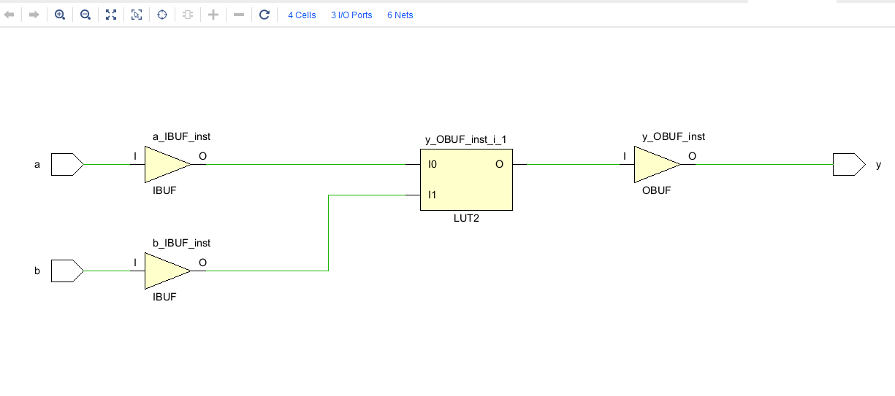
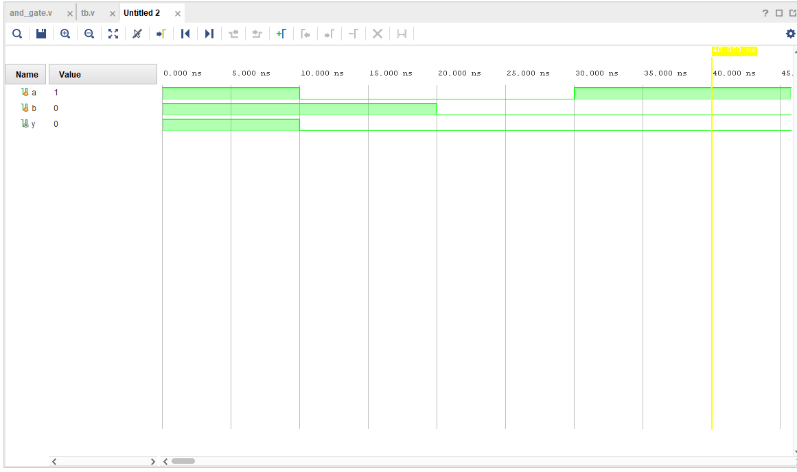

# 🔌 AND Gate – FPGA Implementation using Vivado (Arty S7-25)

This project demonstrates the design, simulation, synthesis, and implementation of a **2-input AND Gate** using **Verilog HDL** on the **Arty S7-25 FPGA board**. The project was developed and tested using the **Xilinx Vivado Design Suite**.

---

## 🎥 Demo Video

  

---

## 📐 Design Overview

- **Module**: `AND_GATE`
- **Inputs**: `A`, `B`
- **Output**: `Y = A & B`
- **Language**: Verilog HDL
- **Target Device**: Arty S7-25 (Spartan-7)
- **Toolchain**: Vivado Design Suite
- **Simulation**: Vivado XSim

---

## 📁 Source Files

- 🔸 **RTL Code** is located in:  
  `AND_GATE.srcs/sources_1/new/`

- 🔸 **Testbench** is located in:  
  `AND_GATE.srcs/sim_1/new/`

These folders contain the Verilog implementation and the testbench used for simulation.

---

## 🧪 Key Results

| Image | Description |
|-------|-------------|
|  | RTL schematic of the AND gate |
|  | Post-synthesis schematic |
|  | Implemented design layout |
|  | Schematic view after implementation |
|  | Testbench waveform showing correct behavior |

---

## ✅ Features

- Clean and minimal RTL code
- Functional testbench for simulation
- Successful synthesis and implementation
- Ready for hardware deployment on Arty S7-25

---

## 👨‍💻 Author

**Ram Tripathi**

---
