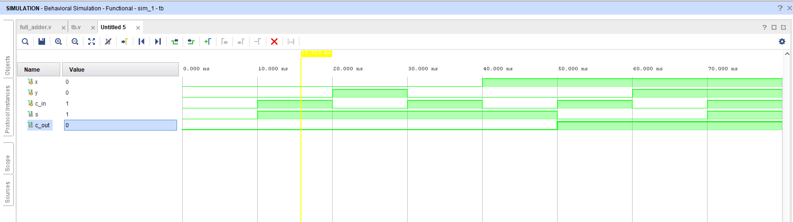
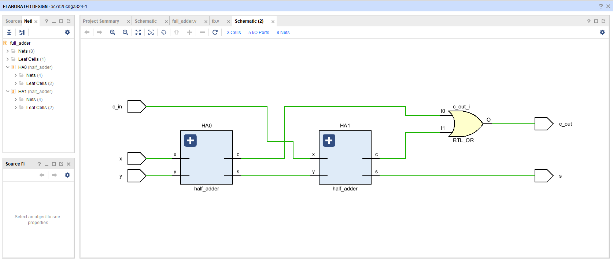
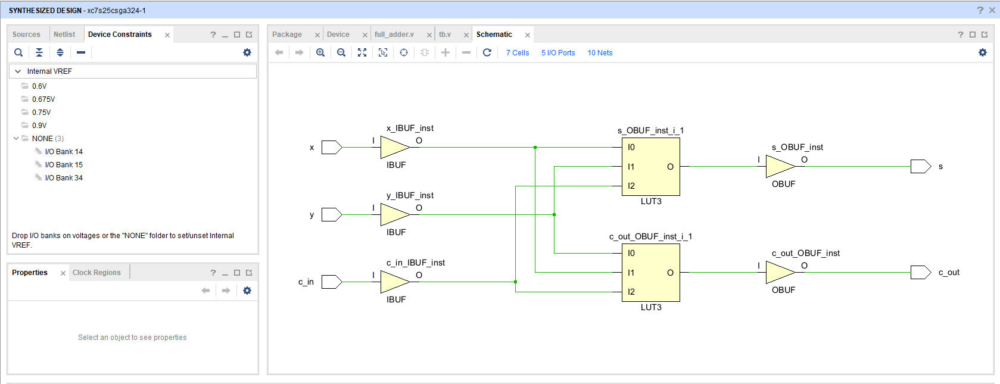
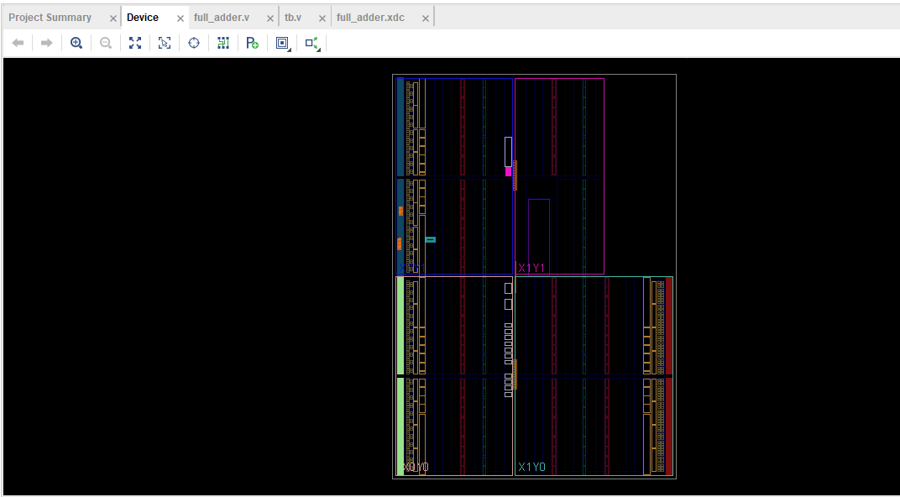

# 🔢 Full Adder – FPGA Implementation using Vivado (Arty S7-25)

This project demonstrates the design, simulation, synthesis, and FPGA hardware implementation of a **1-bit Full Adder** using **Verilog HDL** on the **Arty S7-25 FPGA board**. The design uses two levels of logic with a `half_adder` and `full_adder` module and is verified through simulation and tested on real hardware using switches and LEDs.

---

## 🎥 Demo Video

  

---

## 📐 Design Overview

- **Modules Used**:
  - `half_adder.v` – Handles basic sum and carry
  - `full_adder.v` – Instantiates two half adders to build the full adder logic

- **Testbench**:  
  RTL testbench written to verify all combinations of inputs for the full adder.

- **Target Device**: Arty S7-25 (Spartan-7 FPGA)  
- **Toolchain**: Xilinx Vivado  
- **Simulation Tool**: Vivado XSim

---

## 📁 Source Files

- 🔸 **RTL Code** is located in:  
  `Full_Adder.srcs/sources_1/new/`

- 🔸 **Testbench** is located in:  
  `Full_Adder.srcs/sim_1/new/`

---

## 🧪 Key Results

| Image | Description |
|-------|-------------|
|  | Testbench simulation for the half adder |
|  | RTL schematic of the half adder |
|  | Synthesized schematic of the full adder |
|  | Implemented design on FPGA |

---

## 🔌 FPGA Pin Mapping

| Signal  | Pin | Component | IO Standard |
|---------|-----|-----------|-------------|
| `x`     | H18 | Switch    | LVCMOS33    |
| `y`     | G18 | Switch    | LVCMOS33    |
| `c_in`  | H14 | Switch    | LVCMOS33    |
| `s`     | F13 | LED       | LVCMOS33    |
| `c_out` | E18 | LED       | LVCMOS33    |

---

## ✅ Features

- Modular design using half adders
- Fully functional testbench for pre-synthesis verification
- Verified on FPGA hardware using switches (inputs) and LEDs (outputs)
- Clear visual proof through simulation and implementation schematics

---

## 👨‍💻 Author

**Ram Tripathi** 

