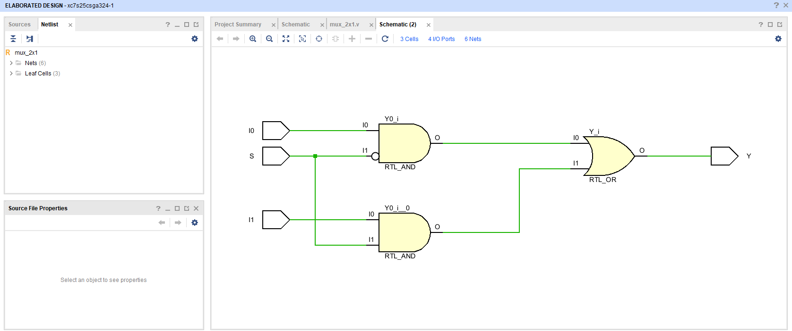
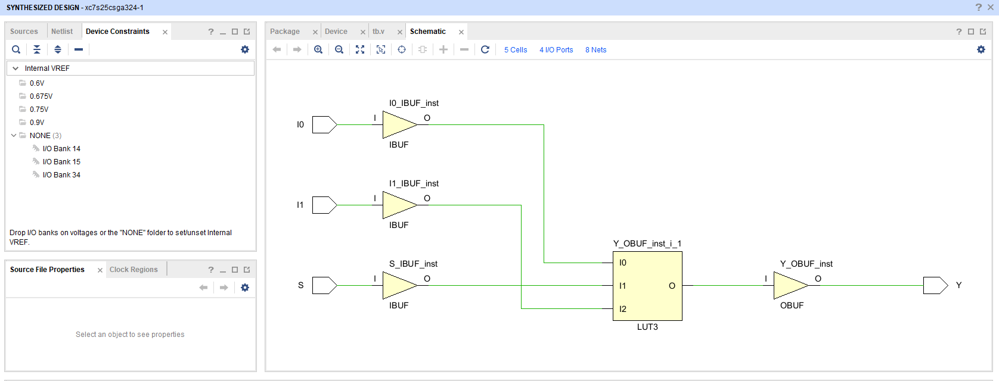
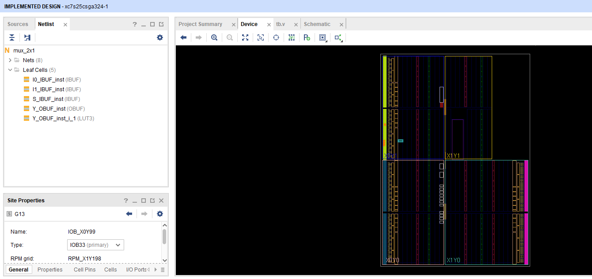
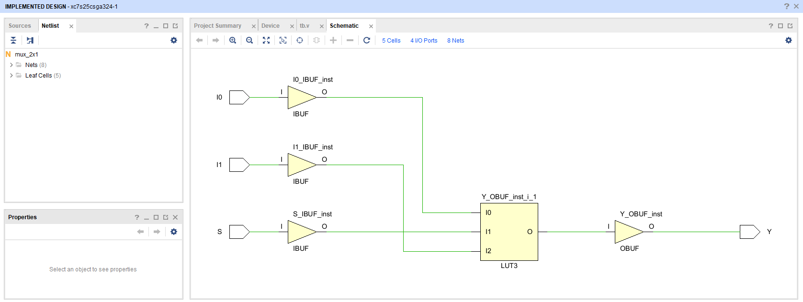
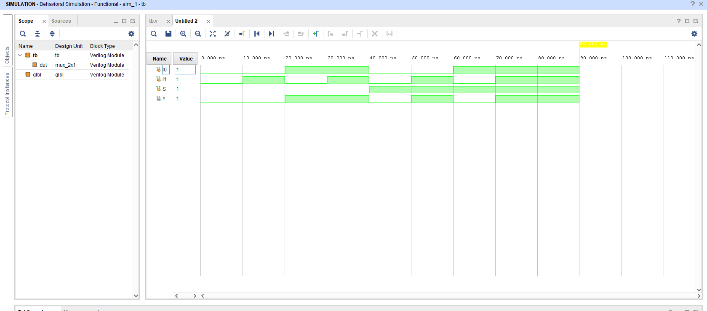

# 🎚️ 2x1 MUX – FPGA Implementation using Vivado (Arty S7-25)

This project demonstrates the Verilog-based design, simulation, synthesis, and FPGA implementation of a **2x1 Multiplexer** using the **Arty S7-25** FPGA board. The project includes full verification using waveform simulation and real hardware validation using switches and LEDs.

---

## 🎥 Demo Video

  

---

## 📐 Design Overview

- **Module**: `mux_2x1`
- **Inputs**:
  - `I0`, `I1` – Data inputs
  - `S` – Select input
- **Output**:
  - `Y` – Output based on select signal

- **Logic**:  
  `Y = (I0 & ~S) | (I1 & S);`

- **Technology**: Verilog HDL  
- **Target Board**: Arty S7-25 (Spartan-7 FPGA)  
- **Toolchain**: Xilinx Vivado  
- **Simulation**: Vivado XSim

---

## 📁 Source Files

- 🔸 **RTL Code**:  
  `mux_2x1.srcs/sources_1/new/mux_2x1.v`

- 🔸 **Testbench**:  
  `mux_2x1.srcs/sim_1/new/tb.v`

---

## 🧪 Key Results

| Image | Description |
|-------|-------------|
|  | RTL elaborated design |
|  | Synthesized schematic |
|  | Implemented design layout |
|  | Schematic of implemented design |
|  | Testbench waveform for all input cases |

---
| Signal | Direction | Description  | FPGA Pin | IO Standard |
| ------ | --------- | ------------ | -------- | ----------- |
| `I0`   | Input     | Data input 0 | H14      | LVCMOS33    |
| `I1`   | Input     | Data input 1 | H18      | LVCMOS33    |
| `S`    | Input     | Select line  | G18      | LVCMOS33    |
| `Y`    | Output    | Output       | E18      | LVCMOS33    |

---

## ✅ Features

- Covers all 8 test cases (2^3 combinations of I0, I1, S)
- Verified functional behavior through waveform simulation
- Successfully implemented on FPGA using physical switches and LEDs
- Clean RTL and modular testbench structure

---

## 👨‍💻 Author

**Ram Tripathi**  

