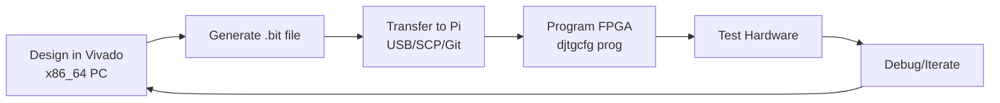

# Raspberry Pi FPGA Programming Station

Transform your Raspberry Pi into a powerful, portable FPGA programming station for Digilent boards using Adept utilities.

  

## 🎯 What This Does

- **Program Digilent FPGA boards** (Arty S7, Basys 3, Nexys, etc.) directly from Raspberry Pi
- **Use .bit files** generated from Vivado on other machines
- **Portable development station** - program FPGAs anywhere with just a Pi
- **Cost-effective solution** - no need for expensive dedicated programmers

## 📋 Requirements

### Hardware
- Raspberry Pi 4 or 5 (ARM64 recommended)
- MicroSD card (16GB+)
- USB cable for your Digilent board
- Digilent FPGA board (Arty S7, Basys 3, Nexys, etc.)

### Software
- Raspberry Pi OS (64-bit Bookworm recommended)
- Internet connection for initial setup

## 🚀 Quick Start

### 1. One-Command Installation

```bash
curl -fsSL https://raw.githubusercontent.com/yourusername/rpi-fpga-programmer/main/install.sh | bash
```

### 2. Manual Installation

```bash
# Check your architecture
dpkg --print-architecture

# Clean up any existing installations
sudo dpkg --remove --force-remove-reinstreq digilent.* 2>/dev/null
sudo apt --fix-broken install
sudo apt update

# Install dependencies
sudo apt install libqt5multimedia5 libqt5multimedia5-plugins libqt5scripttools5 libqt5serialport5 libqt5widgets5 libqt5gui5 libqt5core5a

# Download and install Adept Runtime
wget https://digilent.s3.amazonaws.com/Software/Adept2Runtime/2.27.9/digilent.adept.runtime_2.27.9-arm64.deb
sudo dpkg -i digilent.adept.runtime_2.27.9-arm64.deb

# Download and install Adept Utilities
wget https://digilent.s3.amazonaws.com/Software/AdeptUtilities/2.7.1/digilent.adept.utilities_2.7.1-arm64.deb
sudo dpkg -i digilent.adept.utilities_2.7.1-arm64.deb

# Fix USB permissions
sudo usermod -a -G dialout $USER
sudo tee /etc/udev/rules.d/99-digilent.rules << 'EOF'
SUBSYSTEM=="usb", ATTRS{idVendor}=="0403", ATTRS{idProduct}=="6010", MODE="0666"
SUBSYSTEM=="usb", ATTRS{idVendor}=="0403", ATTRS{idProduct}=="6014", MODE="0666"
SUBSYSTEM=="usb", ATTRS{idVendor}=="1443", MODE="0666"
EOF

sudo udevadm control --reload-rules && sudo udevadm trigger
sudo reboot
```

### 3. Test Your Setup

```bash
# Connect your FPGA board and check detection
djtgcfg enum

# Expected output:
# Found 1 device(s)
# Device: ArtyS7
#     Product Name: Digilent Arty S7 - 25
```

## 💻 Usage

### Basic Programming

```bash
# Program your FPGA with a .bit file
djtgcfg prog -d ArtyS7 -i 0 -f your_design.bit

# Program with verification (recommended)
djtgcfg prog -d ArtyS7 -i 0 -f your_design.bit -v
```

### Advanced Commands

```bash
# List all connected devices
djtgcfg enum

# Get detailed device info
djtgcfg enum -d ArtyS7 --capabilities

# Program with progress indication
djtgcfg prog -d ArtyS7 -i 0 -f design.bit -v --progress
```

## 🔧 Supported Boards

| Board | Device Name | Tested |
|-------|-------------|---------|
| Arty S7-25/50 | `ArtyS7` | ✅ |
| Arty A7-35/100 | `ArtyA7` | ✅ |
| Basys 3 | `Basys3` | ✅ |
| Nexys 4/A7 | `Nexys4` | ✅ |
| Cmod S7 | `CmodS7` | ✅ |
| Analog Discovery | `ADiscovery` | ✅ |

## 📊 Development Workflow



Since Vivado doesn't run on ARM processors, use this hybrid approach:
1. **Design Phase**: Use Vivado on x86_64 computer
2. **Programming Phase**: Use Raspberry Pi for programming and testing

## 🛠️ Troubleshooting

### Device Not Detected
```bash
# Check USB connection
lsusb | grep -E "(0403:6010|1443:)"

# Verify permissions
groups $USER  # Should include 'dialout'

# Check udev rules
ls -l /etc/udev/rules.d/99-digilent.rules
```

### Command Not Found
```bash
# Verify installation
dpkg -l | grep digilent

# Check PATH
which djtgcfg
```

### Permission Errors
```bash
# Re-add user to dialout group
sudo usermod -a -G dialout $USER

# Reload udev rules
sudo udevadm control --reload-rules
sudo udevadm trigger

# Reboot to apply changes
sudo reboot
```

## 📁 Project Structure

```
rpi-fpga-programmer/
├── README.md                 # This file
├── install.sh               # Automated installation script
├── examples/
│   ├── blinky.bit           # Simple LED blinker example
│   └── counter.bit          # 7-segment counter example
├── scripts/
│   ├── program.sh           # Programming wrapper script
│   └── detect-boards.sh     # Board detection utility
└── docs/
    ├── TROUBLESHOOTING.md   # Detailed troubleshooting
    └── BOARDS.md            # Supported boards list
```

## 🤝 Contributing

Contributions welcome! Please read our [Contributing Guidelines](CONTRIBUTING.md) first.

### Ways to Contribute
- 🐛 Report bugs and issues
- 📝 Improve documentation
- ✨ Add support for new boards
- 🧪 Test on different Pi models
- 🔧 Submit bug fixes and improvements

## 📜 License

MIT License - see [LICENSE](LICENSE) file for details.

## 🙏 Acknowledgments

- **Digilent** for providing ARM64 packages and excellent FPGA boards
- **Raspberry Pi Foundation** for the amazing single-board computers
- **Community contributors** who tested and improved this setup

## 📚 Additional Resources

- [Digilent Adept Documentation](https://digilent.com/reference/software/adept/start)
- [Vivado Design Suite User Guide](https://www.xilinx.com/support/documentation/sw_manuals/xilinx2023_2/ug973-vivado-release-notes-install-license.pdf)
- [Raspberry Pi Official Documentation](https://www.raspberrypi.org/documentation/)

## 📞 Support

- **Issues**: [GitHub Issues](https://github.com/yourusername/rpi-fpga-programmer/issues)
- **Discussions**: [GitHub Discussions](https://github.com/yourusername/rpi-fpga-programmer/discussions)
- **Community**: [Discord Server](https://discord.gg/yourinvite)

---

**Made with ❤️ for the FPGA and Raspberry Pi communities**

[](https://github.com/yourusername/rpi-fpga-programmer/stargazers)
[](https://github.com/yourusername/rpi-fpga-programmer/network)
[](https://github.com/yourusername/rpi-fpga-programmer/issues)
